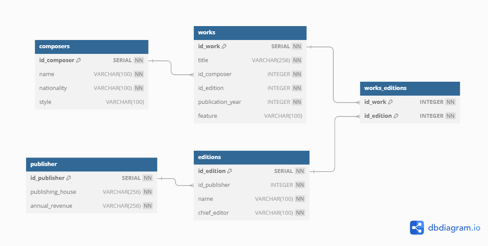

# Composers

[](https://www.sqlite.org/)
[](https://www.docker.com/)
[](https://www.python.org/downloads/release/python-3120/)

SQLite database of classical music composers and their works. Simple installation via **Docker** Image. Written in Python using `SQLalchemy` module for database engine and `sqlite3` package that implements the SQLite interface.

<div style="text-align: center;">
    
</div>

## Installation and usage

### Prerequisites

- Docker
- Python 3.x (for local development)
- Flask
- jq (optional pretty printer)

### Download, build and run the app

You can clone the repository and build the Docker image:

```bash
git clone git@github.com:nierja/composers.git
cd composers
docker build -t classical_music_db .
docker run -p 8080:5000 classical_music_db
```

### Executing SQL queries:

Now that the app runs, you can execute queries.

* Give me all composers and data about them:

    ```bash
    $ curl -X POST -F 'query=SELECT * FROM composers;' http://localhost:5000/query | jq
    {
    "result": [
        [
        1,
        "Ludwig van Beethoven",
        "German",
        "Classical/Romantic"
        ],
        ...
    ```

* Get the number of works published by each composer:

    ```bash
    $ curl -X POST -F 'query=SELECT composers.name, COUNT(works.id_work) AS work_count FROM composers JOIN works ON composers.id_composer = works.id_composer GROUP BY composers.name;' http://localhost:5000/query | jq
    ...
        [
      "Béla Bartók",
      5
    ],
    ...
    ```
